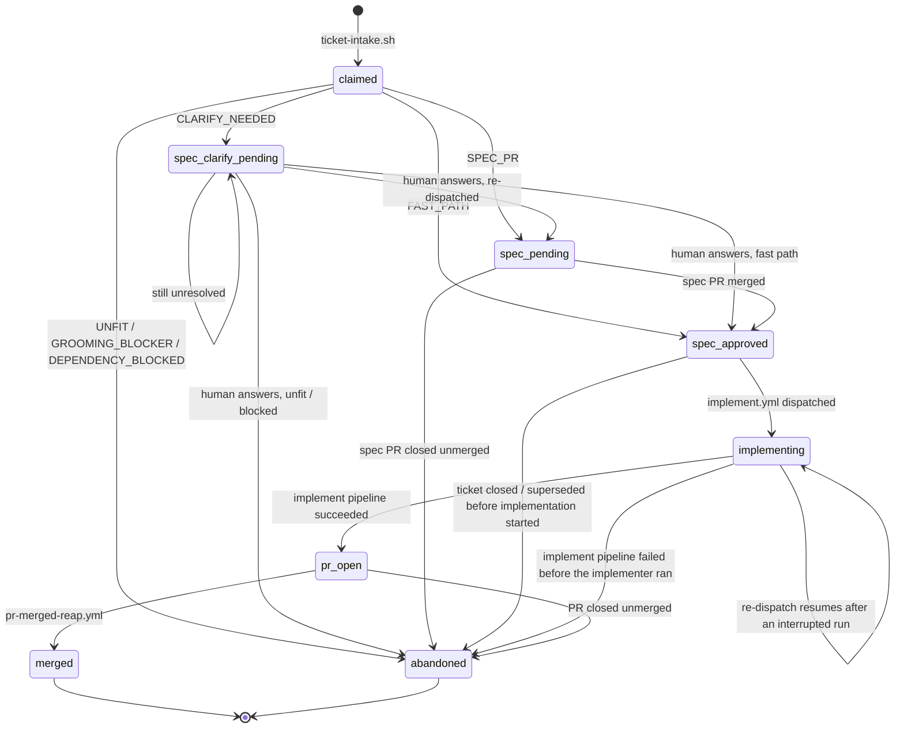

# state/

Git-JSON runtime state for the pipeline. Every file here is committed by a
workflow via `scripts/commit-state.sh` (hash-checked, push-race-safe) —
never hand-edited except for genuinely human-owned policy
(`dependabot-repos.json`'s reviewer pool, `impl-repos.json`'s registry).

## Files

| File | Written by | Purpose |
|---|---|---|
| `queue.json` | `ticket-intake.sh` (creates claims), every pipeline stage via `scripts/update-claim.sh` (transitions them) | One claim per (issue, impl_repo) — where a ticket is in the pipeline |
| `transitions.json` | Hand-edited (this is the policy file) | The claim state machine: allowed `status -> [next statuses]`, enforced by `update-claim.sh` |
| `autonomy-ledger.json` | `ledger-update.yml` | Per-class autonomy level (graduation ladder) |
| `provenance.json` | `record-provenance.sh` | One entry per bot push to a public product repo |
| `impl-repos.json` | Hand-edited | The one product-repo registry — every entry needs a `guards/<repo>.paths` and vice versa |
| `dependabot-repos.json` | Hand-edited | Per-repo Dependabot triage policy |
| `failure-modes.json` | Hand-edited | The failure-pattern catalog the judges cite by ID and `failure-mode-evals.yml` tests against |
| `releases/<tag>/` | `release-intelligence.yml` | Findings, proposed tickets, claim verdicts per example-app-core release |

## The claim state machine

A claim's `status` (in `queue.json`) only ever moves along an edge listed in
`transitions.json`. `scripts/update-claim.sh` reads the claim's current
status, refuses any `to` not in `transitions[from]` (exit 1, naming both
states), and `scripts/validate-state.py` cross-checks that
`transitions.json`'s keys and `schemas/queue-claim.schema.json`'s `status`
enum name the same set of statuses — so the two files can't quietly drift
apart.

(State names above use underscores because Mermaid's `stateDiagram-v2`
treats a bare hyphen in an identifier as invalid; the real `status` values
in `queue.json` and `transitions.json` use hyphens, e.g. `spec-pending`.)

Two edges exist because a fanned-out ticket (one issue, two impl_repo claims) exposed
real gaps: `implementing --> implementing`
makes a re-dispatched/resumed run idempotent instead of failing with `illegal
transition 'implementing' -> 'implementing'`, and `spec-approved --> abandoned` gives
a claim that will never be dispatched (ticket closed or superseded by hand-written
work after its spec merged, before implementation started) a way out — previously
`spec-approved` had no path to `abandoned` at all, so such a claim held a WIP slot
forever.

Two statuses hold no WIP slot without being terminal or invalid:
`spec-clarify-pending` is *parked* — real outgoing edges, just waiting on a
human answer — which is why `scripts/validate-state.py`'s active-claims-vs-
`wip_cap` check excludes it alongside the two true terminal states
(`merged`, `abandoned`, which have empty transition lists in
`transitions.json`).

The `-` status argument to `update-claim.sh` (`update-claim.sh <issue> - <patch>`)
is a patch-only call — it doesn't change `status` at all, so it bypasses
transition enforcement entirely; it's how `claim-verify.yml` records a
verdict without moving the claim.
